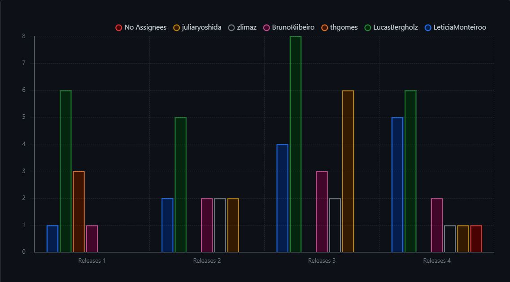
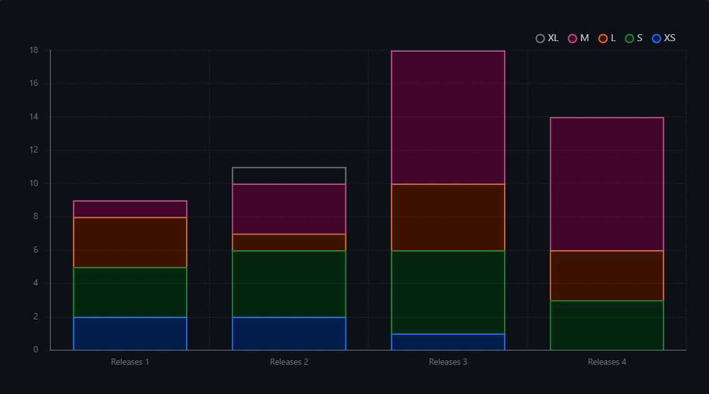
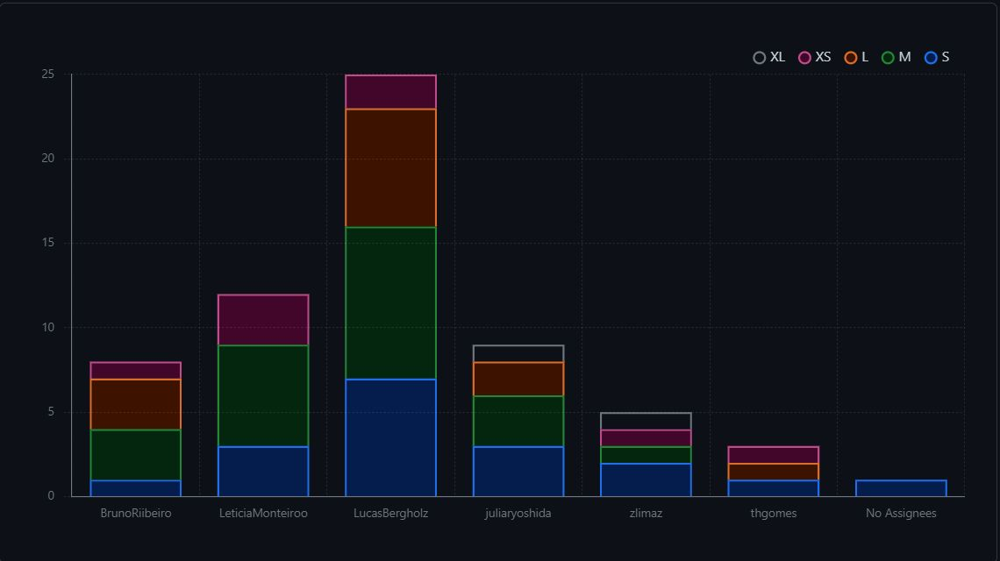

# Backlog

## Histórico de versão

|Data|Versão|Descrição|Autores|
|--|--|--|--|
|04/04/2024|0.1|Adicionando backlog|Lucas Gobbi|
|18/08/2024|0.2|Adicionando gráficos de resolução de issues|Júlia Yoshida|

 Este artefato tem o propósito de reunir informações e conteúdo do backlog desenvolvido pelo grupo para este projeto. Dois quadros foram criados na aplicação Trello, um para acompanhar todas as sprints de cada lançamento e outro para os requisitos que foram levantados nas reuniões do grupo. 

 Todo o conteúdo mencionado abaixo pode ser acessado <a href="https://trello.com/w/unitybrisa" target="_blank">aqui</a>. 

## Quadro de Requisitos

 Este quadro reúne todos os requisitos levantados durante as reuniões do grupo, rotulando-os como Funcionais ou Não Funcionais e qual é a sua prioridade(baixa, média ou alta). 

 Além disso, ele contém informações sobre para qual dos quatro Lançamentos do projeto cada requisito se refere. Outro aspecto importante é o _id_ do requisito, que vem imediatamente antes de seu título, dentro de colchetes. 

 O Quadro de Requisitos pode ser visualizado a seguir: 

<iframe src="https://trello.com/b/q3R7wCJO.html" frameBorder="0" width="900" height="900"></iframe>

## Github Projects

 O Github Projects do grupo foi desenvolvido para uma organização mais adequada das issues do projeto. Cada issue é dividida em algumas categorias, como: tamanho, prioridade, responsável por ela e etc. 

 Para acessar o projects da equipe basta clicar <a href="https://github.com/orgs/ResidenciaTICBrisa/projects/20/views/2">aqui</a> .

 A partir dessas issues e de seus dados, foram desenvolvidos gráficos para análise de performance do grupo, na aba de insights do projects, a qual está sendo utilizado para melhor distribuição de issues para a equipe.

        
    
Imagem 1: issues por release por membro 

        
    
Imagem 2: issues por release

        
    
Imagem 3: issues concluídas por membro do grupo

