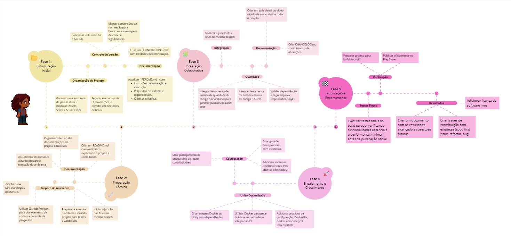
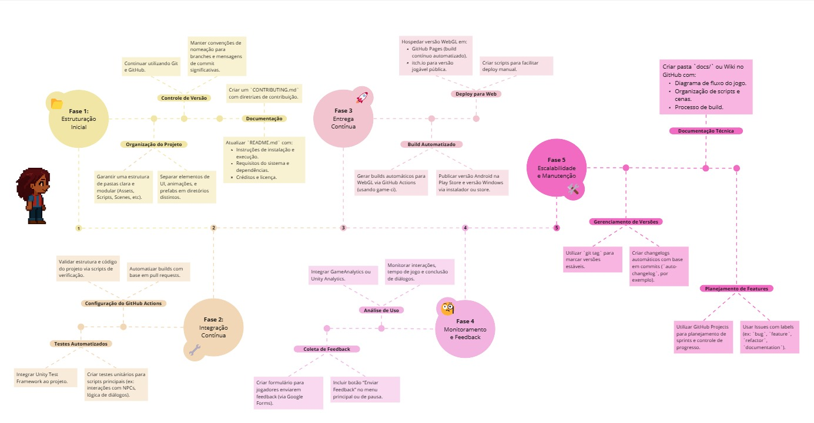

# Roadmap

---

## Roadmap de Proposta de Contribuição (v1.1)

Esta versão (1.1) do roadmap atualiza as estratégias de contribuição ao projeto Jogo-Unity-BOSS com foco aprimorado em automação de testes, integração contínua e painéis de monitoramento. As fases foram revisadas para refletir o progresso atual do projeto e as prioridades identificadas em reuniões recentes.

<iframe width="768" height="432" src="https://miro.com/app/embed/uXjVIAWc6To=/?pres=1&frameId=3458764625498556206&embedId=876067699118" frameborder="0" scrolling="no" allow="fullscreen; clipboard-read; clipboard-write" allowfullscreen></iframe>

---

## Roadmap de Proposta de Contribuição (v1.0) - Arquivo Histórico

Este roadmap propôs ações estratégicas para contribuir com o desenvolvimento contínuo e sustentável do projeto Jogo-Unity-BOSS. A proposta estava dividida em 5 fases principais, visando desde a estruturação até o monitoramento do projeto.

---

## Histórico de versão

| Data       | Versão | Descrição                                                                   | Autores                                                                                          |
| ---------- | ------ | --------------------------------------------------------------------------- | ------------------------------------------------------------------------------------------------ |
| 21/04/2025 | 1.0    | Adicionando versão inicial do roadmap de proposta de contribuição           | [Júlio Cesar](https://github.com/Julio1099), [Maciel Júnior](https://github.com/macieljuniormax) |
| 24/04/2025 | 1.1    | Atualizando roadmap de proposta de contribuição                             | [Júlio Cesar](https://github.com/Julio1099), [Maciel Júnior](https://github.com/macieljuniormax) |
| 01/06/2025 | 1.2    | Nova versão do roadmap com melhorias nas fases de automação e monitoramento | [Júlio Cesar](https://github.com/Julio1099), [Maciel Júnior](https://github.com/macieljuniormax) |
