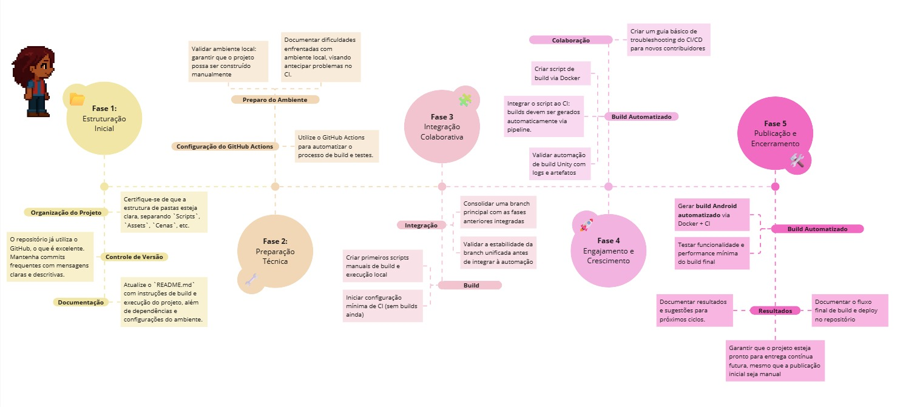
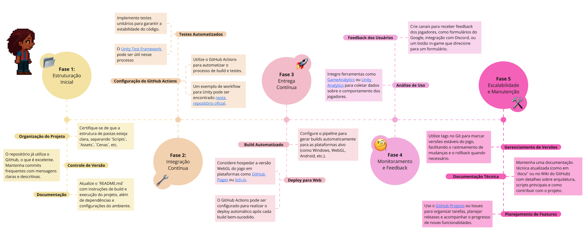

# Roadmap

## Roadmap de Deploy Contínuo (v1.1)

Esta nova versão do roadmap atualiza os estágios de Integração e Entrega Contínuas (CI/CD), incorporando práticas mais avançadas de escalabilidade, monitoramento e segurança contínua. Além disso, reflete a evolução do projeto no uso de pipelines automatizadas e práticas DevOps modernas.

<iframe width="768" height="432" src="https://miro.com/welcomeonboard/NlN4R3RhbTJPTjJZL3FxUTEyTTRGZkZNYVovL2szcDAxMEUzV3UzblBXTUxsR1B1S0t6NDhRem1aYy9QNVArOHlCeXFSMTMxL0QvU3A2aFd5WVF6UEdld0RWSUNxRDJMeXNKbGE5UTc1Yy9NeVE0bjJ5NUJVZTMrMTZiMURHZzl0R2lncW1vRmFBVnlLcVJzTmdFdlNRPT0hdjE=?share_link_id=176364753528" frameborder="0" scrolling="no" allow="fullscreen; clipboard-read; clipboard-write" allowfullscreen></iframe>

---

## Roadmap de Deploy Contínuo (v1.0) - Arquivo Histórico

Este roadmap descreve os passos necessários para implementar **Integração e Entrega Contínuas (CI/CD)** no projeto, bem como garantir escalabilidade e manutenção contínua.

A imagem a seguir apresenta uma visão geral das etapas envolvidas na implementação de integração e entrega contínuas (CI/CD), bem como das práticas associadas à escalabilidade e manutenção do projeto. O quadro interativo no Miro, disponibilizado em sequência, permite uma análise mais aprofundada das fases e atividades propostas.

---

## Histórico de versão

| Data       | Versão | Descrição                                                                                     | Autores                                                                                          |
| ---------- | ------ | --------------------------------------------------------------------------------------------- | ------------------------------------------------------------------------------------------------ |
| 20/04/2025 | 1.0    | Adicionando versão inicial do roadmap de deploy contínuo                                      | [Júlio Cesar](https://github.com/Julio1099), [Maciel Júnior](https://github.com/macieljuniormax) |
| 01/06/2025 | 1.1    | Atualizando o roadmap de deploy contínuo com novos estágios de escalabilidade e monitoramento | [Júlio Cesar](https://github.com/Julio1099), [Maciel Júnior](https://github.com/macieljuniormax) |
