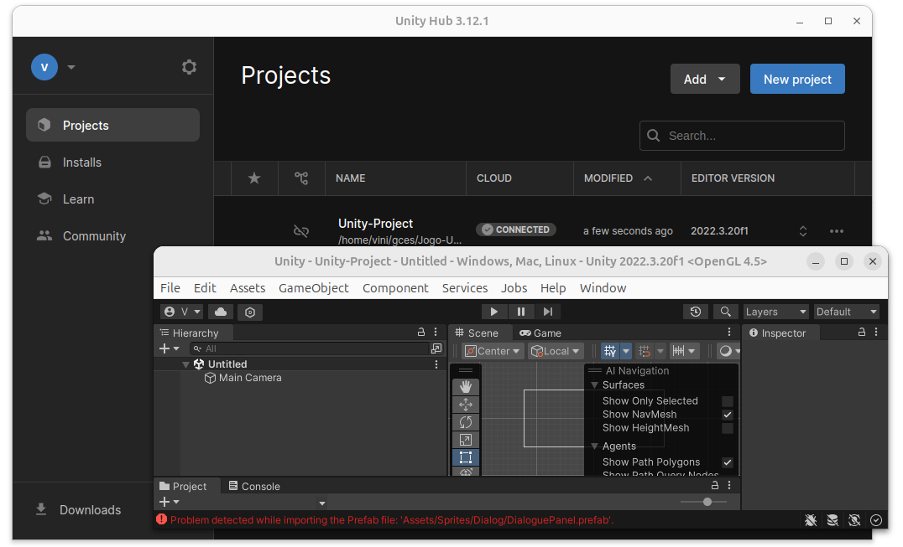
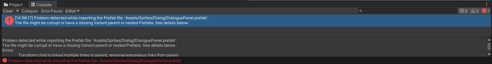

# 📄 Erro Problema Unity

Ao tentar subir o ambiente do projeto no Unity, foi encontrado um erro relacionado ao prefab `DialoguePanel.prefab`, localizado no diretório `Assets/Sprites/Dialog/`. Esse problema impossibilitou a correta abertura e execução do ambiente de desenvolvimento.

O erro é reportado diretamente no console do Unity com a seguinte mensagem:

> **"Problem detected while importing the Prefab file: 'Assets/Sprites/Dialog/DialoguePanel.prefab'. The file might be corrupt or have a missing Variant parent or nested Prefabs. Errors: Transform child is linked multiple times to parent; removed extraneous links from parent."**

Esse erro sugere que o arquivo de prefab pode estar corrompido, estruturalmente comprometido ou referenciando um prefab pai ausente, especialmente se esse prefab for uma variante de outro prefab base. Além disso, foi detectado um problema na hierarquia interna do objeto, onde um ou mais objetos filhos estão vinculados múltiplas vezes ao mesmo objeto pai, o que viola a integridade da estrutura de prefabs no Unity.

A inspeção direta do arquivo `DialoguePanel.prefab` no formato YAML mostra que ele possui referências (`fileID`) que podem estar desconectadas de objetos ou prefabs necessários. Apesar do arquivo fisicamente existir no diretório do projeto, há indícios de que ele não está estruturado corretamente ou foi danificado, possivelmente durante um processo de versionamento, transferência de arquivos ou corrupção local do cache do Unity.

Esse tipo de problema pode causar falhas na renderização do prefab na hierarquia, impedir sua instanciação nas cenas e impactar funcionalidades relacionadas à interface de diálogo do jogo. O Unity tenta, automaticamente, remover vínculos inválidos, mas nem sempre consegue restaurar a integridade completa do asset.

---

## 🎯 Causas Prováveis:

- Corrupção do arquivo `DialoguePanel.prefab`.
- Referência ausente a um prefab pai (no caso de ser uma variante).
- Problema na serialização do prefab durante transferência via Git, Google Drive ou outro meio.
- Versões diferentes do Unity que geraram incompatibilidade na leitura do prefab.
- Alteração manual incorreta no arquivo YAML do prefab.

---

## 🖼️ Imagens do Erro

### 📌 Erro apresentado imagem 1:

### 📌 Erro apresentado imagem 2:

### 📌 Erro apresentado imagem 3:

---

# 📄 Erro de versão do Unity Editor

Ao tentar abrir o projeto no Unity, foi encontrado um erro relacionado à versão do Unity Editor. A mensagem de erro indica que a versão do projeto é incompatível com a versão do Unity instalada.

## Mensagem de Erro

> **"This project was last opened in Unity 2022.3.20f1. It cannot be opened with the current version of Unity (2022.3.20f1). Please upgrade your project to a newer version of Unity."**

## ⚠️ Causas Prováveis

- O projeto foi criado ou modificado em uma versão específica do Unity (2022.3.20f1) e não é compatível com a versão atual instalada.
- O Unity Hub pode estar configurado para abrir o projeto com uma versão diferente da que foi usada originalmente.

## 🎯 Soluções Possíveis

- Verifique se a versão do Unity instalada é a mesma que foi usada para criar o projeto. No caso, certifique-se de ter a versão **2022.3.20f1**, ou superior, instalada.
- Abra o Unity Hub e vá para a aba "Installs" (Instalações) para verificar as versões instaladas.

- Se a versão correta não estiver instalada, adicione-a através do Unity Hub:

  1. Abra o Unity Hub.

  2. Vá para a aba "Installs" (Instalações).

  3. Clique em "Add" (Adicionar) e selecione a versão **2022.3.20f1**, ou superior.

  4. Certifique-se de incluir os módulos necessários, como suporte ao Android e iOS, considerando que o intuito do jogo é rodar em dispositivos mobile.

- Após instalar a versão correta, tente abrir o projeto novamente através do Unity Hub.

---

## Histórico de versão

| Data       | Versão | Descrição                                                            | Autores                                              |
| ---------- | ------ | -------------------------------------------------------------------- | ---------------------------------------------------- |
| 01/06/2025 | 1.0    | Adicionando versão inicial do documento de erros conhecidos          | [Vinicius Castelo](https://github.com/Vini47)        |
| 02/06/2025 | 1.1    | Adicionando problemas com versão do Unity Editor e correção de typos | [João Gabriel Antunes](https://github.com/flyerjohn) |
