# Artes e Referências

## Histórico de versão

|Data|Versão|Descrição|Autores|
|--|--|--|--|
|04/04/2024|0.1|Adicionando referências|Miguel Arthur|
|10/04/2024|0.2|Adicionando artes próprias|Júlia Yoshida|
|04/07/2024|0.3|Adicionando artes próprias|Júlia Yoshida|
|18/08/2024|0.4|Adicionando artes próprias|Júlia Yoshida|

 Para o desenvolvimento do projeto, estão sendo utilizadas artes de uso livre em conjunto com artes próprias desenvolvidas pelo nosso time. 

## Ninja Adventure Asset Pack

 O <a href="https://pixel-boy.itch.io/ninja-adventure-asset-pack" target="_blank">Ninja Adventure Asset Pack</a> é um pacote de artes de uso livre que estamos utilizando para criar cenários e NPCs.

 A licença desse Asset Pack é o CC0 (Creative Commons Zero). A CC0 é uma licença em que é permitido usar o uso livre das artes, até mesmo para fins comerciais, sem a necessidade de atribuir créditos.

## Artstation

 O <a href="https://samu.artstation.com/albums/78871" target="_blank">ArtStation.com</a> é um pacote de artes de uso livre que estamos utilizando para criar blocos. O Autor é o Andreas Paul, conhecido por ser um entusiasta em artes em 3D.

## FoxelDev

 <a href="https://foxeldev.itch.io/pixelbooks" target="_blank">FoxelDev.Itch.Io</a> é um pacote de artes de uso livre de acordo com a licença: CCO 1.0 - Universal, do autor Foxel Games na qual usamos para pegar a referência do nosso livro da tela inicial e para usar futuramente dentro do jogo.

## Artes próprias

### Personagem principal - Sofia

 As artes da personagem principal, Sofia, foram desenhadas no Aseprite pela Júlia. O faceset da Sofia e as sprite sheets de todos os movimentos dela estão apresentadas a seguir.
 

     
    
Imagem 1: Faceset da Sofia

     
    
Imagem 2: Sprite sheet da personagem parada(idle)

    
    
Imagem 3: Sprite sheet da personagem andando de frente

    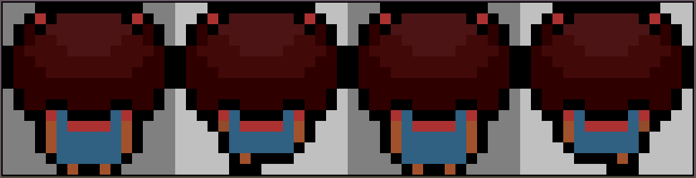
    
Imagem 4: Sprite sheet da personagem andando de costas

    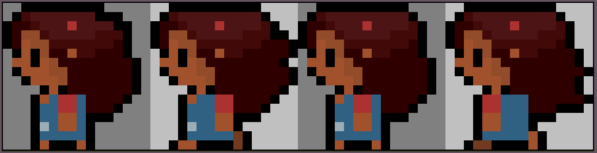 
    
Imagem 5: Sprite sheet da personagem andando para esquerda/diagonal esquerda

    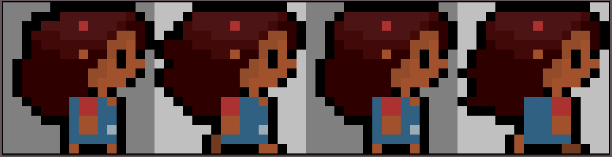
    
Imagem 6: Sprite sheet da personagem andando para direita/diagonal direita

    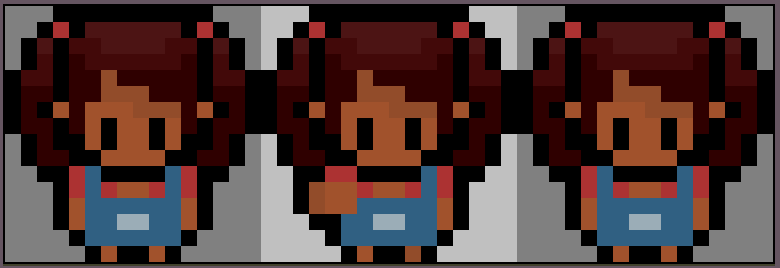
    
Imagem 7: Sprite sheet da personagem socando de frente

    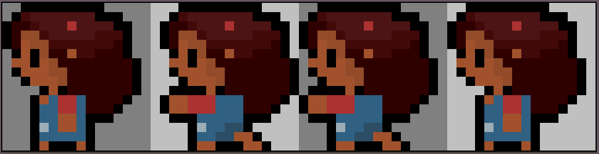
    
Imagem 8: Sprite sheet da personagem socando de lado(esquerda)

    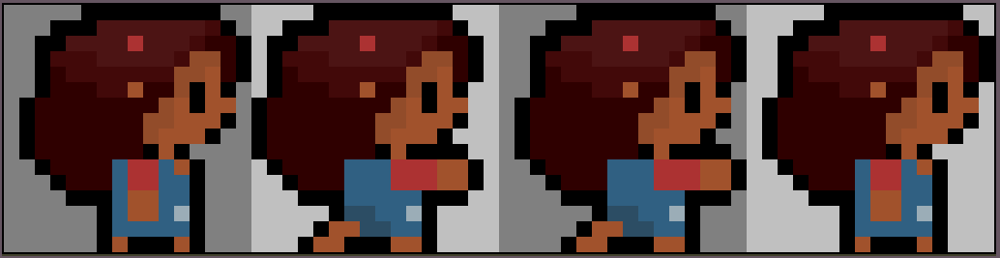    
    
Imagem 9: Sprite sheet da personagem socando de lado(direita)

    
    
Imagem 10: Sprite sheet da personagem socando de costas

### Prefeito

 As artes do prefeito foram desenhadas no Aseprite pela Letícia. As sprite sheets de todos os movimentos dele estão apresentadas a seguir.
 

     
    
Imagem 1: Sprite sheet do personagem parado(idle)

    
    
Imagem 2: Sprite sheet da personagem andando de costas

    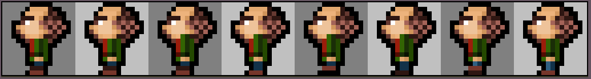 
    
Imagem 3: Sprite sheet da personagem andando para esquerda/diagonal esquerda

    
    
Imagem 4: Sprite sheet da personagem andando para direita/diagonal direita

### Robô cinza

 As artes do movimento do robô foram desenhadas pela Letícia e a arte do faceset dele foi desenhada pela Júlia. As sprite sheets de todos os movimentos dele estão apresentadas a seguir.
 

    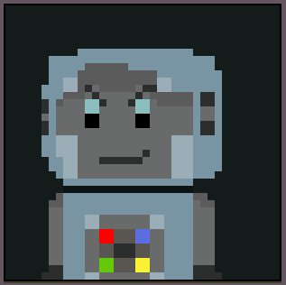 
    
Imagem 1: Faceset do robô

    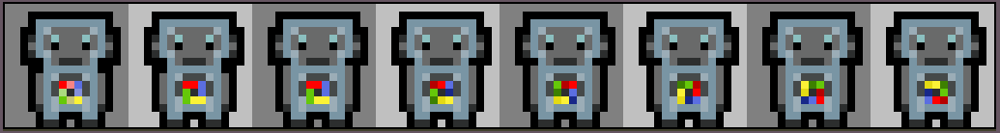 
    
Imagem 2: Sprite sheet do personagem parado(idle)

    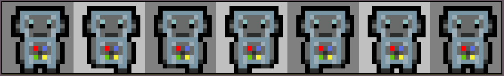
    
Imagem 3: Sprite sheet do personagem andando de frente

    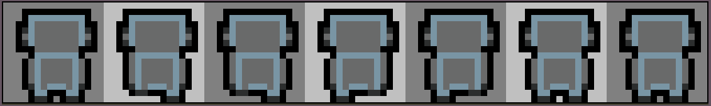
    
Imagem 4: Sprite sheet da personagem andando de costas

    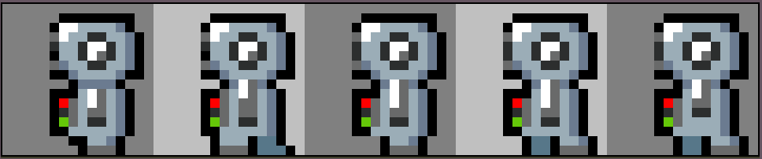 
    
Imagem 5: Sprite sheet da personagem andando para esquerda/diagonal esquerda

    
    
Imagem 6: Sprite sheet da personagem andando para direita/diagonal direita

### Inventário

 A arte do inventário foi desenhada no Aseprite pela Júlia. 
 

    
    
Imagem 1: Arte do inventário

### Robô vermelho

 A arte do robô vermelho foi desenhada no Aseprite pela Letícia. 
 

    
    
Imagem 1: Sprite sheet do robô vermelho andando

### Prefeito robô

 A arte do prefeito robô foi desenhada no Aseprite pela Letícia. 
 

    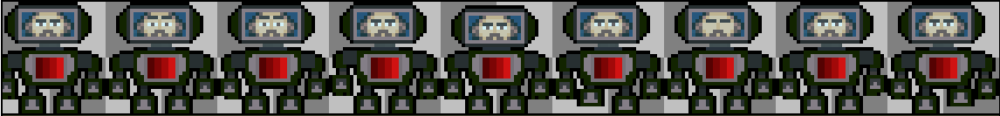
    
Imagem 1: Sprite sheet do prefeito robô andando

