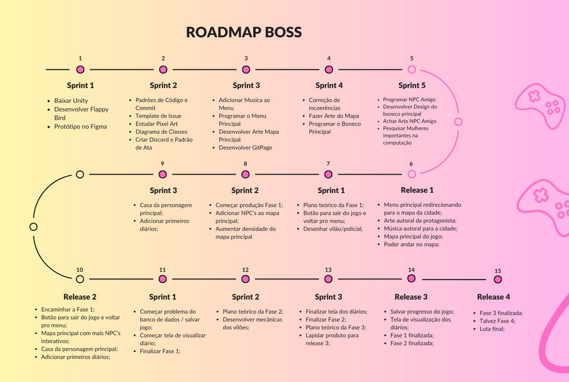

# Roadmap

## Histórico de versão

|Data|Versão|Descrição|Autores|
|--|--|--|--|
|04/04/2024|0.1|Adicionando roadmap|Miguel Arthur|
|07/04/2024|0.2|Adicionando sprints|Júlia Yoshida|

## ROADMAP - BOSS

## Quadro de Sprints

 O Quadro de Sprints contém informações de cada sprint de cada lançamento, onde cada sprint representa um painel neste quadro, e os cartões dentro do painel são as atividades que serão realizadas. 

 Cada cartão contém informações sobre o conteúdo da atividade, os membros que estão trabalhando nela, a data máxima para concluí-la e rótulos que se referem à dificuldade da atividade(fácil, média e difícil) e área do projeto (como estudo, documentação ou uma tarefa de jogo). 

 O Quadro de Sprints pode ser visualizado a seguir: 

<iframe src="https://trello.com/b/r3MhZzla.html" frameBorder="0" width="900" height="900"></iframe>
