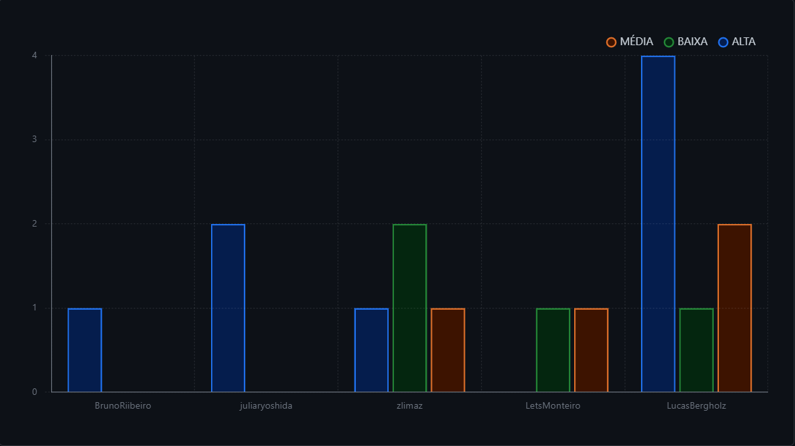

# Roadmap e Sprints

## Histórico de versão

|Data|Versão|Descrição|Autores|
|--|--|--|--|
|04/04/2024|0.1|Adicionando roadmap|Miguel Arthur|
|07/04/2024|0.2|Adicionando sprints|Júlia Yoshida|
|06/05/2024|0.3|Adicionando Github projects|Lucas Gobbi|

Essa seção está dividida em sprints, cada uma com duração de uma semana, que detalham o trabalho realizado por nós, além dos tutoriais e materiais que orientaram nosso estudo.

## ROADMAP - BOSS

## Quadro de Sprints

 O Quadro de Sprints contém informações de cada sprint de cada lançamento, onde cada sprint representa um painel neste quadro, e os cartões dentro do painel são as atividades que serão realizadas. 

 Cada cartão contém informações sobre o conteúdo da atividade, os membros que estão trabalhando nela, a data máxima para concluí-la e rótulos que se referem à dificuldade da atividade(fácil, média e difícil) e área do projeto (como estudo, documentação ou uma tarefa de jogo). 

 O Quadro de Sprints pode ser visualizado a seguir: 

<iframe src="https://trello.com/b/r3MhZzla.html" frameBorder="0" width="900" height="900"></iframe>

## Github Projects

 O Github Projects do grupo foi desenvolvido para uma organização mais adequada das issues do projeto. Cada issue é dividida em algumas categorias, como: tamanho, prioridade, responsável por ela e etc. 

 A partir dessas issues e de seus dados, foram desenvolvidos gráficos para análise de performance do grupo, na aba de insights do projects, a qual está sendo utilizado para melhor distribuição de issues para a equipe.

 Para acessar o projects da equipe basta clicar <a href="https://github.com/orgs/ResidenciaTICBrisa/projects/20/views/2">aqui</a> .
