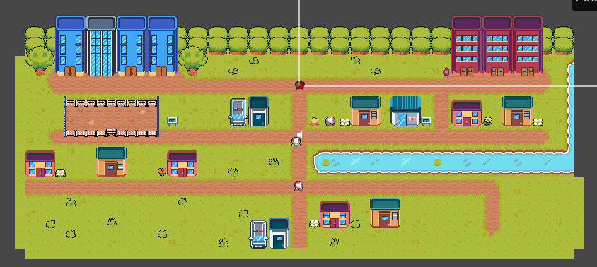
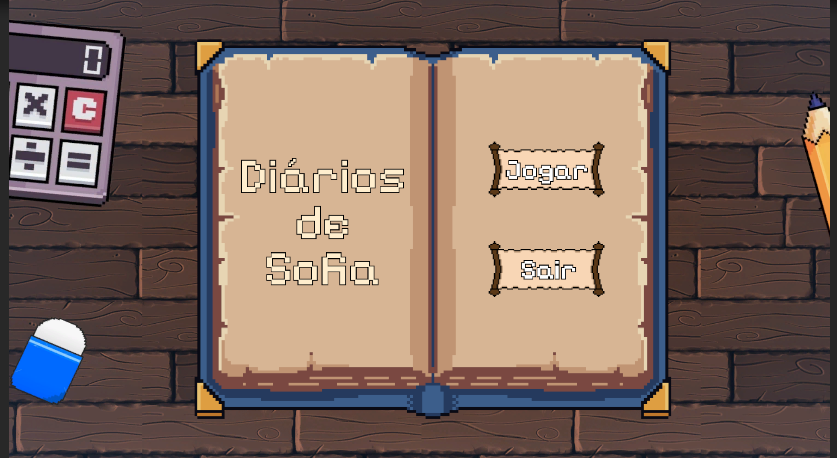
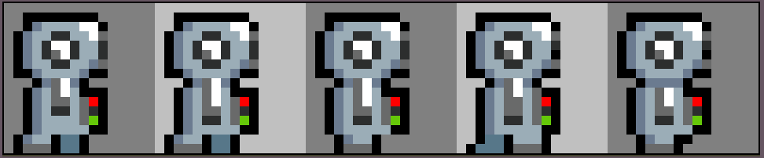
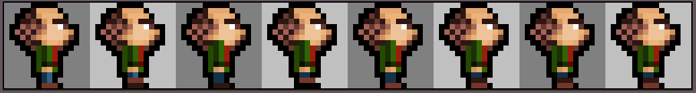
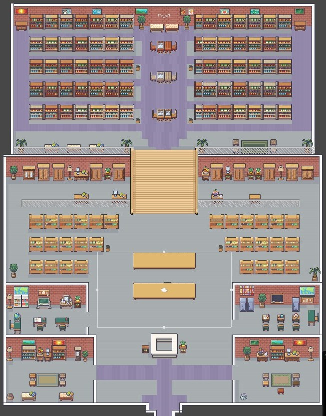

## Histórico de versão

|Data|Versão|Descrição|Autores|
|--|--|--|--|
|18/04/2024|0.1|Adicionando a linha do tempo|Júlia Yoshida|
|06/05/2024|0.2|Adicionando novos pontos marcantes|Lucas Gobbi|
|18/08/2024|0.3|Adicionando novos pontos marcantes|Júlia Yoshida|

 Aqui se encontram os momentos marcantes do projeto e os responsáveis por essas tarefas.

<b>27 de março: História do jogo definida.</b>
 *Autores:* Lucas Gobbi, Letícia Monteiro, Miguel Arthur e Thiago Gomes.

 Na cidade de Ogama, as coisas são como são e ninguém discorda de nenhuma das regras. A principal delas: mulheres não têm direito ao ensino superior. Para Sofia, isso sempre foi motivo de incômodo, mas nunca viu ninguém ao seu redor lutar para que algo diferente aconteça.

Em "Diários de Sofia", o jogador deve coletar ao longo do jogo itens que contam a história deste mundo, dentre eles, os diários da personagem principal, os quais desvendarão os porquês dessa cidade ser do jeito que é. Seguindo as dicas deixadas em cada um desses itens, rapidamente será visível como a solução está em mostrar que, se outras mulheres foram capazes de feitos tão incríveis, por qual motivo as de agora não seriam?

<b>31 de março: Mapa da cidade concluído</b>
 *Autor:* Lucas Gobbi
  

<b>1 de abril: Menu finalizado</b>
 *Autor:* Lucas Gobbi
  

<b>5 de abril: Arte da personagem principal finalizada</b>
 *Autor:* Júlia Yoshida 
  

<b>6 de abril: Personagem principal programada dentro do jogo </b>
 *Autor:* Thiago Gomes
 

<b>8 de abril: Artes autorais de NPC policial e vilão do jogo</b>
 *Autor:* Letícia Monteiro
  

  

<b>12 de abril: Música da cidade</b>
 *Autor:* Bruno Ribeiro
 

<b>15 de abril: Template de NPC's desenvolvido</b>
 *Autor:* Lucas Gobbi
 

<b>25 de abril: Interação com NPC's desenvolvida, com efeitos sonoros e template de UI da interação</b>
 *Autor:* Lucas Gobbi
  

 

<b>30 de abril: Ataque da personagem programado</b>
 *Autor:* Lucas Gobbi
  

 

<b>06 de maio: Ambiente da fase 1 completo</b>
 *Autor:* Júlia Yoshida e Miguel Arthur
  

 

<b>09 de junho: Inventário da fase 1 e suas mecânicas concluídas</b>
 *Autor:* Júlia Yoshida
 

<b>10 de julho: Arte autoral do robô vermelho</b>
 *Autor:* Letícia Monteiro
  

 
