# Configurando o ambiente

## Tutorial em vídeo

<iframe width="560" height="315" src="https://www.youtube.com/embed/AQlJhmqQVDs" title="Tutorial em vídeo" frameborder="0" allow="accelerometer; autoplay; clipboard-write; encrypted-media; gyroscope; picture-in-picture" allowfullscreen></iframe>

---

## Tutorial Unity for Women

### Adquirindo o Unity Hub

1. Download

   - https://unity.com/pt/download

     ou

   - https://unity.com/download

   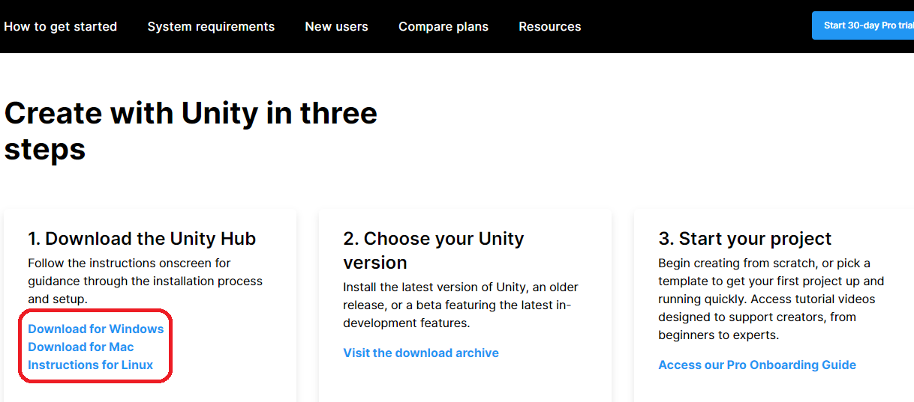

2. Instalação
   1. Linux
      - Abra o terminal (ctrl + alt + T)
      - Acesse sua pasta de downloads (ou a pasta onde você fez o download do instalador) utilizando o comando cd
      - Rode os comandos abaixo:
        - chmod +x UnityHub.appimage
        - ./UnityHub.appimage
   2. Windows/MAC
      - Execute o instalador
      - Siga o processo normalmente

### Configurando o Unity Hub:

⚠Caso apareça a tela de licença, você pode ativar uma licença gratuita Unity Personal ou, se quiser, adquirir uma licença de estudante universitário utilizando suas credenciais institucionais

1.  Clique em Install > Install Editor ou Add
    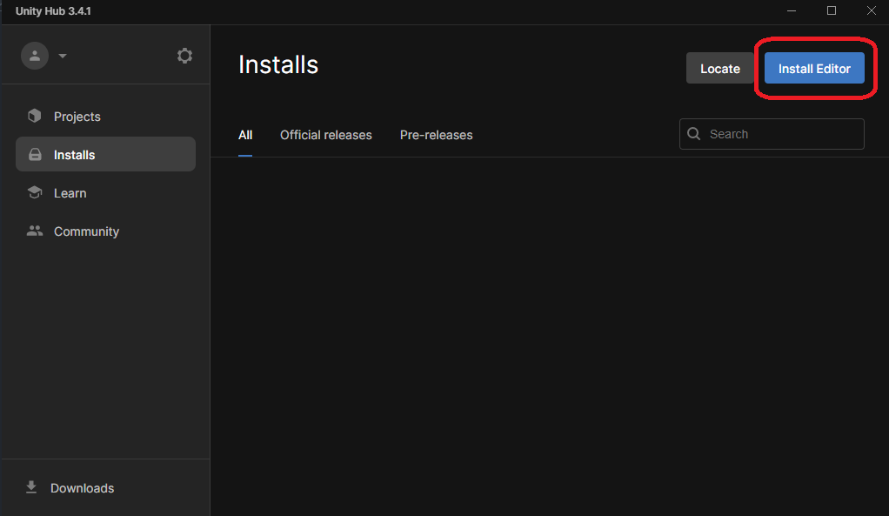

2.  Selecione a versão LTS(Long Term Support) mais recente e clique Install
    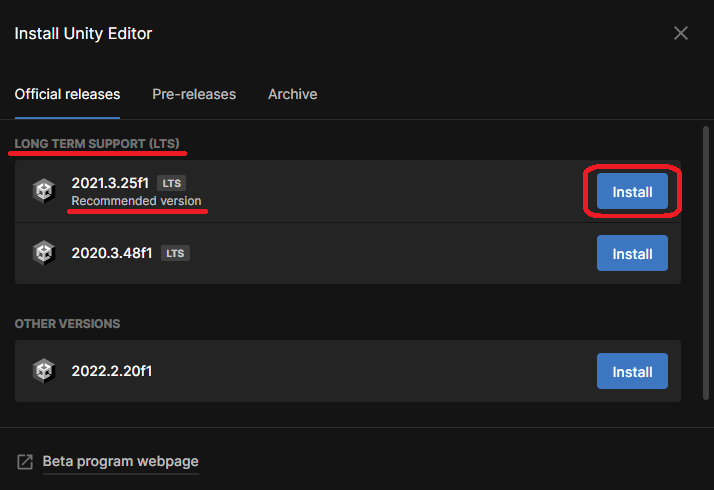

3.  Na tela de módulos, desselecione as outras opções caso necessário
4.  Remova versões anteriores anteriores caso necessário

### Criando um projeto Unity

1.  Clique em Projects > New project
    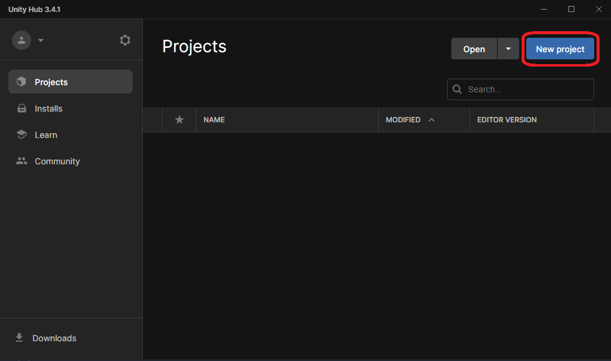

2.  Selecione o template 3D e nomeie seu projeto como desejar
    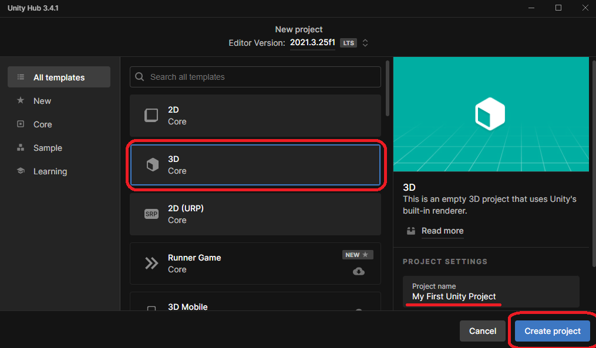

3.  Clique em seu projeto recém criado para abri-lo (pode demorar vários minutos)

### Configuração de IDE

Para este workshop recomendamos o uso de Visual Studio Community pela funcionalidade nativa de code completion de C# para Unity. Se desejar usar outra IDE, siga o passo 3 para definí-la como padrão do Unity; recomendamos também procurar recursos on-line sobre plugins de code completion Unity para sua IDE.

1.  Baixe [Visual Studio Community](https://visualstudio.microsoft.com/pt-br/vs/community/)(é nescessário ter uma conta microsoft)
2.  Ao configurar a instalação, selecione a carga de trabalho para Unity

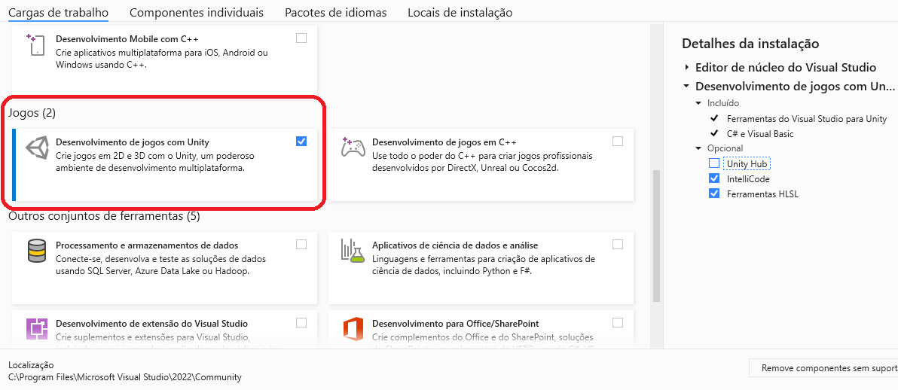

3.  Dentro do unity vá em Edit>Preferences>External Tools>External Script Editor e selecione "Microsoft Visual Studio 2022"

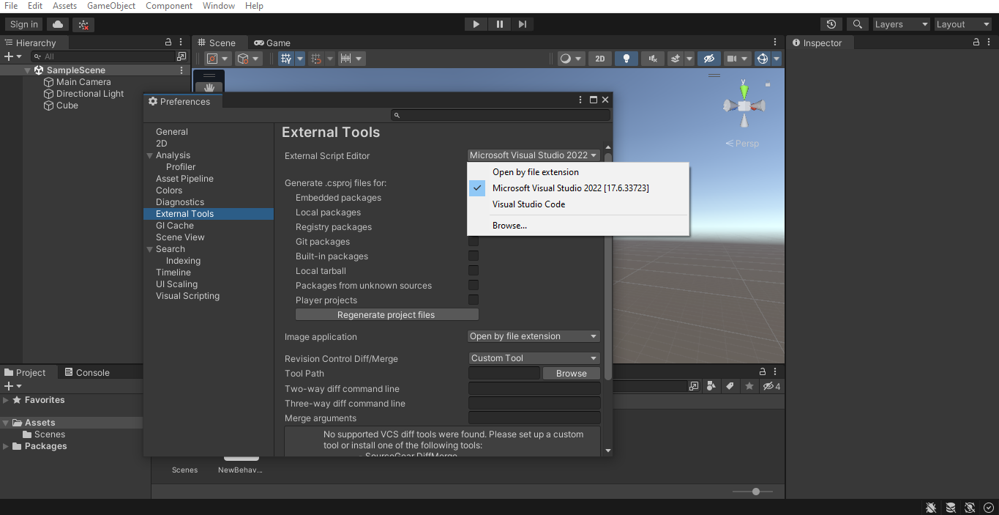
⚠Caso a opção não apareça, selecione browse e escolha o executável do Visual Studio na pasta de instalação "devenv.exe"

### Básicos do Unity

#### Movimentos

- Clique e segure com o botão direito enquanto move o mouse na tela interativa para olhar em direções diferentes
- Use a rodinha do mouse para movimentar-se para frente e para trás
- Aperte e segure a rodinha do mouse para movimentar a perspectiva lateralmente (segure shift para acelerar)

#### Câmera

- Pode-se alterar entre a perspectiva de jogador e developer com as abas “Game” e “Scene” na parte superior da tela
- Clicando no objeto câmera mostra a parte do ambiente 3D que será mostrada no jogo (Também pode ser visto através da aba "Game")

#### Obejeto e Componente

1.  Para criar seu primeiro objeto:
    - Na aba "Hierarchy" à esquerda, clique com o botão direito e selecione 3D Object > Cube

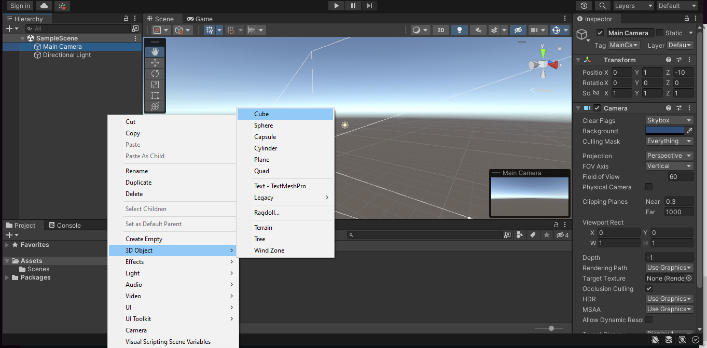

2.  Para adicionar física ao seu objeto, utilizaremos um componente chamado RigidBody:
    - Clique no objeto para exibir seus componentes na aba “Inspector” na direita
    - Clique em “Add Component” no fim da aba
    - Busque e adicione a opção RigidBody

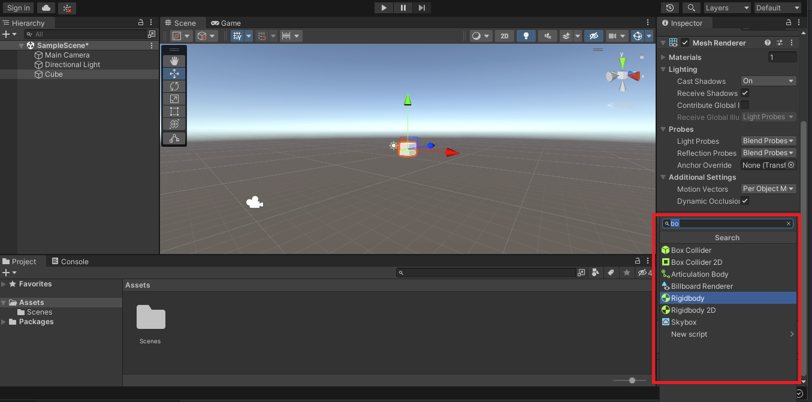

#### Testar jogo

- Olhe pela perspectiva de jogo para confirmar se o cubo está visível em tela
  - Caso não esteja, clique no cubo na perspectiva de edição e utilize os controles de posição(setas coloridas) para movê-lo até estar na frente da câmera
- Clique no botão play na parte superior para começar a execução do jogo
  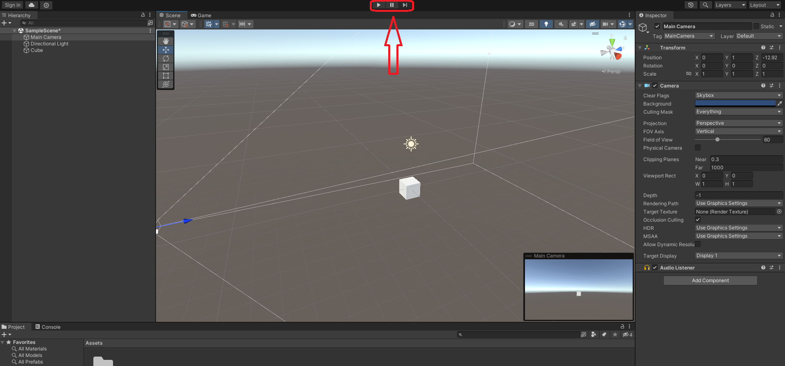

- Você deverá observar o cubo criado caindo

  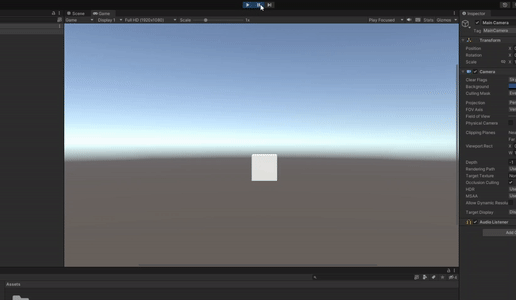

- Nos controles superiores, você pode pausar ou parar a execução do jogo
- Lembre-se de pará-la sempre antes de modificar objetos ou componentes em cena, ou as modificações poderão ser perdidas

[Voltar para a Página Principal](./wokshop_home.md)
